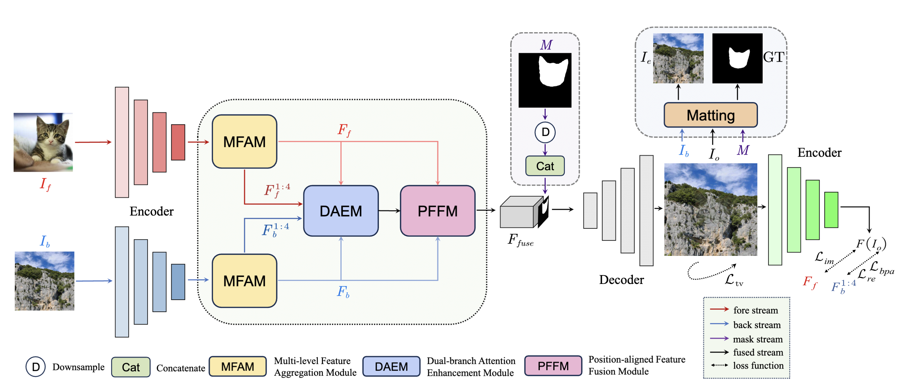
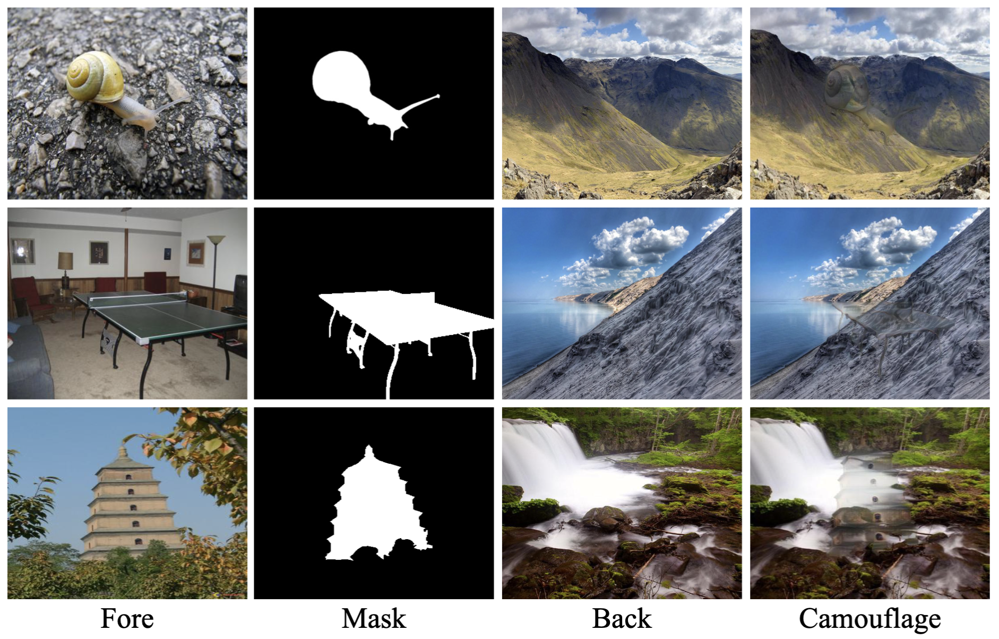

# Harmonize the Concealment and Salience: Adaptive Camouflage Synthesizing Network for Camouflage Images Generation (ACS-Net)

This is the pytorch implementation of our **IJCNN 2025** paper "*Harmonize the Concealment and Salience: Adaptive Camouflage Synthesizing Network for Camouflage Images Generation*".

+ Authors: Yuhang Qian, Haiyan Chen, Dongni Lu, Longwu Yang, Xinyu Jiang and Jie Qin.
+ Institution: College of Computer Science/Software, College of Artifical Intelligence, Nanjing University of Aeronautics and Astronautics **(NUAA)**, China.

This repository is based on and inspired by [LCG-Net](https://github.com/Tale17/LCG-Net) proposed by Li et al. *"Location-free camouflage generation network"*.

<p align="middle">
    
</p>

## Examples
<p align="middle">
    
</p>

# Usage
## Preparing Environment
You can type the following commands in your terminal to build the python environment for ACS-Net with conda/miniconda, our cuda version is 11.3.

```
conda create --prefix=/path/to/ACS_Net python=3.8
conda activate ACS_Net
pip install -r requirements.txt
```
you can switch *"/path/to"* to your customized pathes.

## Dataset preparing
Our dataset for training ACS-Net and generating camouflage images requires foreground data and background data. For foreground data, you can download COCO2017 and DUTS from website, while for background data, you can download BG20K from website, another back dataset is available at [here](https://www.kaggle.com/datasets/arnaud58/landscape-pictures). Please notice that COCO not directly provide binary masks, you can utilize pycocotools package to operate coco jsons and generate binary masks from instance annotations via color threshold teciniques, view *get_mask.py* for reference.

We also provide datasets we organized for training ACS-Net, you can download from this [panBaidu link](https://pan.baidu.com/s/1Xb1RWBRg5fyfWm8UFwB4sA), code: 98QA.

## Downloading models
We provide the pre-trained VGG19 encoder (required before training) and our trained decoder and MFAM, DAEM, PFFM (FFuse.pth), you can download and put them to *./models* for quick demo.
+ [pre-trained VGG19](https://drive.google.com/file/d/1jDRZpEyEUExSns6bK9L7JIt-ULzIXC70/view?usp=drive_link)
+ [decoder.pth](https://drive.google.com/file/d/1_ci_mlcQZdDVk6BMk1sLMuj6BbnFDi6g/view?usp=drive_link)
+ [FFuse.pth](https://drive.google.com/file/d/1yEBobuoRcdD-tKBrGM2IF5fY9Ar-OHjV/view?usp=drive_link)
  
## Demo&Test
### simple demo
You can generate a camouflage image provided with fore, mask and back images using **test.py** and **test_final.py** , we pre-define 16 initial examples in *input/fore, input/mask, input/back* and final examples in *input/final*. The position parameters are also pre-defined in **params_position.py**. You can control the argparse parameters such as --use_examples, --fore, --back, --mask, --output for your customized images generation. Please modify the values of these parameters to make sure they fit your file organization.
```python3
python test.py
python test_final.py
```
### generating batch of camouflage images
We empoly **generate_cam.py** for ACS-Net testing. It takes the DUTS-TE (testset of DUTS) as input, while background images are randomly selected from a given dataset. It enables generating multiple camouflage images.
```python3
python generate_cam.py
```

## Training
You can change the value of **os.environ['CUDA_VISIBLE_DEVICES']** to sepcify the GPU id you use. Once training dataset is prepared, you can alter the path parameters in argprase and run the command to start training ACS-Net.
```python3
python train.py
```
The training logs will defaultly saved in *./tf-logs*, you can run this command in terminal and click to the link to view the value of training losses via tensorboard.
```python3
python -m tensorboard.main --logdir=./tf-logs
```


# Summary
This repository provide the pytorch implentment for the Adaptive Camouflage Synthesizing Network (ACS-Net). We acknowledge a lot to the contribution of LCG-Net. If you find our work helpful, please cite our work. For any questions, please raise issues on github or contact me at qianyuhang@nuaa.edu.cn .